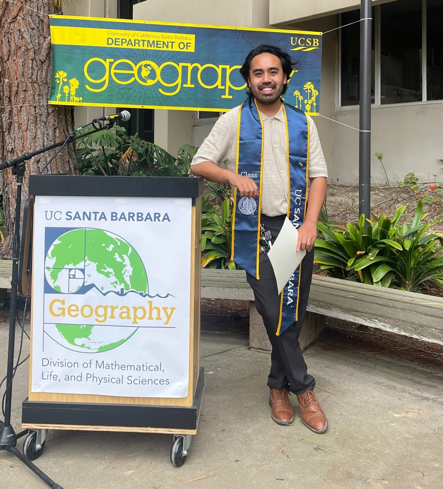

# Hello, my name is Tyler Padua.

{height=50%}

I am a graduate from the University of California, Santa Barbara, with a BA in Geography with Emphasis in Geographic Information Systems. I want to demonstrate my knowledge of GIS through data acquisition, manipulation, analysis, and programming by showcasing some of the work I’ve done as an undergraduate. I am aspiring to earn a career in GIS or data analysis.

